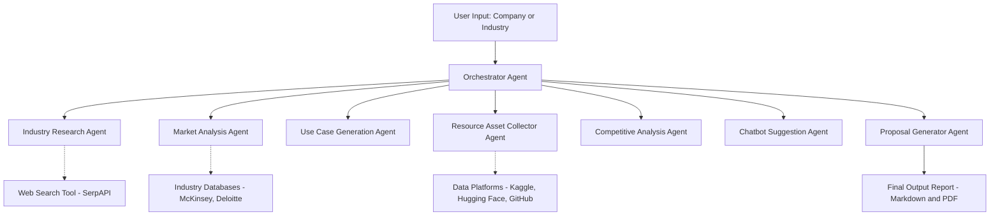

# 🤖 GenAgentX – AI Strategy Engine

GenAgentX is a multi-agent AI system that automates the process of market research, AI/GenAI strategy generation, and resource discovery for any given company or industry. Powered by Google Gemini, SerpAPI, and Streamlit, this tool delivers business-aligned insights, datasets, chatbot suggestions, and a downloadable AI strategy report.

---

## 🧠 System Architecture


---
## 🚀 Live Demo

🔗 [Click here to try GenAgentX on Streamlit](https://genagentx-yourname.streamlit.app)

---

## 🚀 Key Features

- 🔍 **Industry Research**: Understand company domain, offerings, and strategic focus
- 💡 **AI/GenAI Use Case Generator**: Create customized, actionable AI use cases
- 📂 **Dataset Discovery**: Search Kaggle, Hugging Face, GitHub for open resources
- 🏁 **Competitive Analysis**: Identify how peers use AI
- 🤖 **Chatbot Suggestions**: Propose internal and customer-facing GenAI chatbot ideas
- 📥 **Auto Report Generation**: Downloadable Markdown and PDF summary

---

## 🛠 Tech Stack

- 🧠 **LLM**: Google Gemini (Generative AI)
- 🔍 **Search**: SerpAPI
- 🌐 **UI**: Streamlit
- 📦 **PDF Generator**: Markdown2 + pdfkit
- 🧰 **Multi-Agent Design**: Modular architecture

---

## 📥 Try It Locally

```bash
git clone https://github.com/akshayshekade/genagentx.git
cd genagentx
pip install -r requirements.txt
streamlit run app.py
```

🔑 Set your API keys in `.env`:

```env
GEMINI_API_KEY=your_google_gemini_key
SERP_API_KEY=your_serpapi_key
```

---

## 📘 Sample Report Output

- 📄 Markdown: `report.md`
- 🧾 PDF: `report.pdf`

---

## 📌 Future enhancements

- Agent retraining using RAG pipelines
- LLM routing via LangChain or CrewAI
- Chatbot deployment via WhatsApp or Slack

---

## 🤝 Let's Connect

Feel free to connect on [LinkedIn](https://www.linkedin.com/in/akshayshekade/) or drop a ⭐ on this repo if you found it useful!
