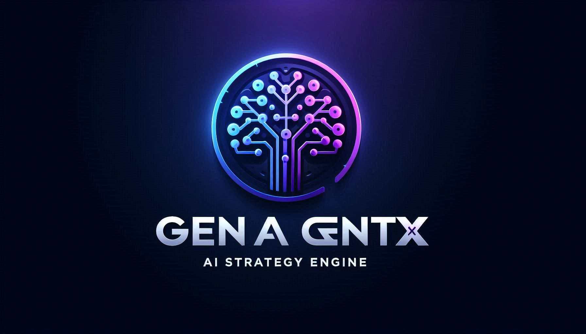

<p align="center">
  
</p>

<h1 align="center">GenAgentX – AI Strategy Engine</h1>

<p align="center">
  GenAgentX is a multi-agent AI system that automates the process of market research, AI/GenAI strategy generation, and resource discovery for any given company or industry. Powered by Google Gemini, SerpAPI, and Streamlit, this tool delivers business-aligned insights, datasets, chatbot suggestions, and a downloadable AI strategy report.

</p>

---

## 🧠 System Architecture


---

## 🚀 Key Features

- 🔍 **Industry Research**: Understand company domain, offerings, and strategic focus
- 💡 **AI/GenAI Use Case Generator**: Create customized, actionable AI use cases
- 📂 **Dataset Discovery**: Search Kaggle, Hugging Face, GitHub for open resources
- 🏁 **Competitive Analysis**: Identify how peers use AI
- 🤖 **Chatbot Suggestions**: Propose internal and customer-facing GenAI chatbot ideas
- 📥 **Auto Report Generation**: Downloadable Markdown and PDF summary

Everything runs on an LLM-driven agent pipeline using **Google Gemini**, **SerpAPI**, and **Streamlit**.

---

## 🛠 Tech Stack

- 🧠 **LLM**: Google Gemini (Generative AI)
- 🔍 **Search**: SerpAPI
- 🌐 **UI**: Streamlit
- 📦 **PDF Generator**: Markdown2 + pdfkit
- 🧰 **Multi-Agent Design**: Modular architecture

---

## 📁 Folder Structure

```
genagentx/
│
├── my_agents/                  # All agents
├── utils/                      # Prompts, search, etc.
├── app.py                      # Streamlit app
├── generate_report.py          # Markdown & PDF report
├── report.md / report.pdf      # Sample outputs
├── .env                        # API keys
└── README.md
```

---
## 📥 Try It Locally

```bash
git clone https://github.com/akshayshekade/genagentx.git
cd genagentx
pip install -r requirements.txt
streamlit run app.py
```

🔑 Set your API keys in `.env`:

```env
GEMINI_API_KEY=your_google_gemini_key
SERP_API_KEY=your_serpapi_key
```

---

## 📘 Sample Report Output

- 📄 Markdown: `report.md`
- 🧾 PDF: `report.pdf`

---

## 📌 Future enhancements

- Agent retraining using RAG pipelines
- LLM routing via LangChain or CrewAI
- Chatbot deployment via WhatsApp or Slack

---

## 🤝 Let's Connect

* 💼 [LinkedIn](https://www.linkedin.com/in/akshayshekade/)
* 🌐 [Portfolio](https://akshayshekade.netlify.app/)
* ✉️ [Email](mailto:akshayshekade757@gmail.com)

---

> Made with ❤️ using Streamlit, Google Gemini, and a multi-agent mindset.
